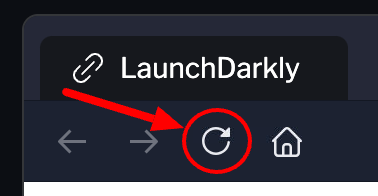

# Lab 7

Release Assistant provides us with release pipelines which allow us to better track progress as well as receive notifications as phases are completed. This allows us to have a consistent release process with every release.

Before continuing, make sure to reload the LaunchDarkly tab by clicking the reload button near the top-left part of the tab (see below).

You'll see we've created a new flag for you called **Brand New Rollout Feature**.

A pipeline lets us configure various stages from development all the way through to production.

Let's get started with our first release pipeline.

1. From the left-hand navigation menu, click **Release assistant**.
2. Click the **Create release pipeline** button located at the bottom under Release Policy
3. In the first phase, leave the **Name** field as **Testing phase**.
4. For **Environment**, select **Test**.
5. For **Audience**, select **Segments**.
6. For **Segments**, click the **[[+]]**, click on **Developers**, then click the **X** to hide the segment selector.
7. Click **Done**.

Let's add a new phase between testing and production.

1. Click the **+** between the two phase panels.
2. For the **Name** field, enter `QA Phase`.
3. For **Environment**, select **QA**.
4. For **Audience**, leave it as **Everyone**.
5. Click **Done**.

Now let's configure the final phase for production.

1. Leave the **Name** field as **Production phase**.
2. For **Environment**, select **Production**.
3. For **Audience**, leave it as **Everyone**.
4. Click **Done**.
5. Click **Create release pipeline**.

We now have a nice view of the different phases our flags can go through. It's time to add our flag to our release pipeline.

1. On the **Testing phase** panel, click **+ Add flags**.
2. Select the **Brand New Rollout Feature** flag.
3. Click on the newly-added entry labeled **Test**.

Notice the **Releases** section on the right-hand side of the screen. We can see all the steps needed to move the flag to a "released" state.

From the right-hand navigation menu under **Release assistant** click the blue play button. Notice how our flag moved to the next phase. Release pipelines provide a nice, visual check-in to see how our flags are marching toward a release, making it easier to stay on track without missing critical phases.
